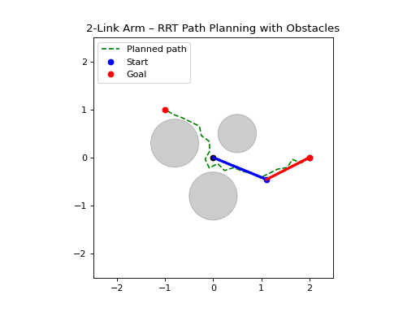
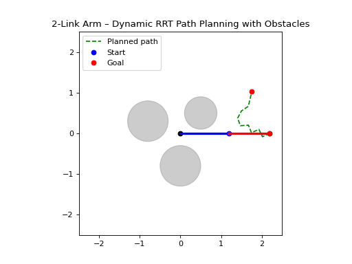

# 🚀 RRT-Based Obstacle Avoidance for 2-Link Robot Arm (2D Simulation)

This project demonstrates how a **2-link planar robotic arm** can plan collision-free motions using **Rapidly-Exploring Random Tree (RRT)** in workspace (x, y), and then convert the planned waypoints into **joint trajectories using IK (Inverse Kinematics)**.

This represents the next major step after:
- Computer vision ➜ Repo 1  
- Robotics math fundamentals ➜ Repo 2  
- Coordinate frames simulation ➜ Repo 3  
- Forward & Inverse kinematics ➜ Repo 4  
- Smooth cubic IK trajectory tracking ➜ Repo 5  
➡ **Now Repo 6 focuses on planning collision-free paths.**

---

## 🧠 What RRT solves in robotics

> “The target might be reachable — but not reachable **safely**.”

Example:
A straight movement from start ➜ goal might intersect an obstacle.
So instead of direct IK, we need **motion planning** that finds a safe path through free space.

RRT does this by:
1. Randomly sampling points in the workspace
2. Growing a tree from the start toward unexplored space
3. Biasing growth toward the goal
4. Stopping when the tree reaches the goal without collisions

Once the RRT returns a sequence of reachable waypoints:
→ IK computes joint angles for each waypoint  
→ Trajectory smoothly executes them  

This mimics real manipulation pipelines:
> **Planner (RRT) → IK → Robot motion**

---

## 🔬 Math & Logic Summary

### 2-Link Arm Workspace
Let link lengths = L₁ and L₂  
End-effector reachable radius:
- |L₁ − L₂| ≤ r ≤ (L₁ + L₂)

### IK for each waypoint (x, y)
- cosθ₂ = (x² + y² − L₁² − L₂²) / (2 L₁ L₂)
- θ₂ = arccos(cosθ₂)
- θ₁ = atan2(y, x) − atan2(L₂ sinθ₂, L₁ + L₂ cosθ₂)

### Obstacle collision check
A link collides with an obstacle circle if:
- Distance between link midpoint and obstacle center < radius
- Distance between link midpoint and obstacle center > radius - link length

### RRT
- Randomly sample points in workspace
- Grow tree from start toward unexplored space
- Bias growth toward goal
- Stop when tree reaches goal without collisions

---

## 🧩 Project Structure

rrt-obstacle-avoidance-2d-arm/
│
├── arm_math.py # FK + IK for 2-link arm
├── obstacles.py # Circles / collision checks / world config
├── rrt_planner.py # Core RRT algorithm (workspace exploration)
│
├── sim_rrt_ik_arm.py # RRT → IK → smooth motion (single goal)
├── sim_rrt_ik_arm_dynamic_re_goal.py # Auto re-goal & replan repeatedly
│
└── README.md

---

## 🎥 Simulation Previews

### 🟢 Single Goal — RRT + IK Execution
The arm plans once using RRT and follows the path safely.
- sim_rrt_ik_arm.py


---

### 🔵 Dynamic Re-Goal — Looping RRT Replanning
The goal moves every time the previous one is reached.  
Each time the robot:
1. Selects a new random valid goal
2. Runs RRT again
3. Converts waypoints to motion via IK
4. Executes safely around obstacles
- sim_rrt_ik_arm_dynamic_re_goal.py


---

## 📌 File-by-File Explanation

| File | Role | Summary |
|------|------|---------|
| `arm_math.py` | Kinematics | Forward & Inverse Kinematics for 2-link arm |
| `obstacles.py` | World & collisions | Defines circular obstacles + link intersection test |
| `rrt_planner.py` | Planner | Builds a collision-free tree to reach goal in workspace |
| `sim_rrt_ik_arm.py` | Simulation 1 | Single RRT plan → IK path → safe motion |
| `sim_rrt_ik_arm_dynamic_re_goal.py` | Simulation 2 | Re-goals repeatedly → fresh RRT plan every time |

---

## 💡 Why this project matters in real robotics

Feature | This repo teaches the foundation of
--------|-------------------------------------
Collision-free motion | MoveIt / OMPL path planning
IK with obstacles | Manipulator workspace safety
Dynamic replanning | Human-robot interaction / conveyor picking
Goal changes | Visual servoing / object tracking in motion
Planning pipeline | **Planner → IK → Trajectory → Robot**

IK alone answers **“How to reach the point?”**  
RRT answers **“How to reach it *without crashing*?”**

Together they form core manipulation logic used in:
- UR, Kuka, Franka Emika robot arms
- ROS2 MoveIt motion planners
- Industrial pick-and-place systems

---

## ▶️ Run the simulations

### Single-goal simulation
```bash
python sim_rrt_ik_arm.py
```
### Dynamic re-goal simulation
```bash
python sim_rrt_ik_arm_dynamic_re_goal.py
```

---

🏁 Takeaway

After building this project, I now understand:

✔ Why IK alone is NOT enough
✔ Why manipulators need planning + IK
✔ How RRT discovers safe paths around obstacles
✔ How to convert workspace waypoints to joint motions
✔ How dynamic replanning handles moving targets / changing environments